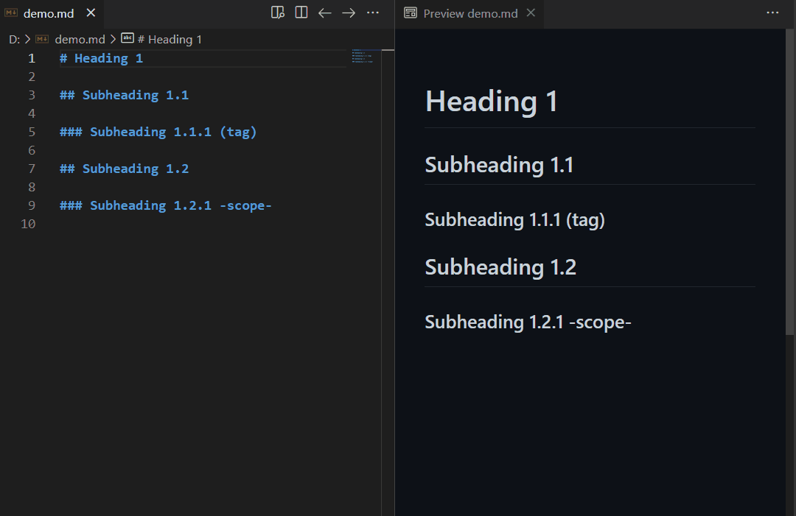

# Markdown AutoTOC

Auto-generates the table of contents to VS Code's built-in markdown preview.

## Features

- Auto-generates the table of contents
- Supports to customizes heading levels
  - See below [Settings](#settings)
- Supports to customizes title header
  - See below [Settings](#settings)
- Supports Azure DevOps Wiki style table of contents token
  - See below [Settings](#settings)
- Supports to slugify exactly the same as VS Code's markdown for the anchor of the table of contents

## Installation

To install this extension go to `View->Extensions` and search for `markdown-auto-gen-toc`. Next click Install.

## Usage

Type the `[[TOC]]` syntax where ever you want to insert the table of contents.

## Settings

Table of contributed settings (prefix "markdownAutoTOC."):

| Name                | Default               | Description                                                                                                         |
| ------------------- | --------------------- | ------------------------------------------------------------------------------------------------------------------- |
| includeLevel        | `[2, 3]`              | Heading levels to include in the generated table of contents                                                        |
| containerClass      | `"table-of-contents"` | The HTML class to apply to the container `
` for the table of contents                                         |
| containerHeaderHtml | `"Contents"`          | Optional HTML string  to display above the table of contents                                                        |
| markerPattern       | `"TOC"`               | Regex pattern of the token to generate the table of contents (Use `"(TOC\|_TOC_)"` for Azure DevOps Wiki style) |

> **Important:** Any changes made don't take effect until the VS Code window is reloaded or restarted, because the configuration settings could applied when the extension is activated.

## Issues

If you find any problems using this extension or you want to propose new features to it, feel free to open an issue on [Github](https://github.com/phoihos/vscode-markdown-auto-gen-toc/issues).

## Release Notes

Detailed Release Notes are available [here](https://github.com/phoihos/vscode-markdown-auto-gen-toc/blob/master/CHANGELOG.md) or above **Changelog** tab.

## Attributions

Icon made by [Freepik](https://www.flaticon.com/authors/freepik) from [www.flaticon.com](https://www.flaticon.com/)
